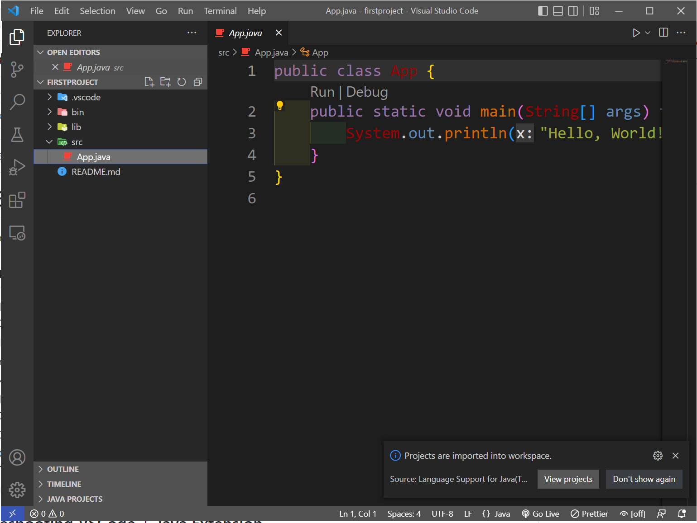

# Dissecting Hello World

When you first create a Java project in VSCode, you will be given a starter template as pictured below.



Let's discuss some things going on here.  We'll be revisiting a lot of this once we have more knowledge under our belt, but we should give a few things a nod.

## Project Folder Contents

Looking at your side bar, you'll see that within your project a series of folders were created.

- `.vscode`
- `bin`
  - You will write source code (in java) in files in the `src` folder.  When you "run" your program (shortcut is F5 key), your course code will be compiled  
  into a binary.  The compiled binary(ies) will be here, in your `bin` folder.
  - You don't edit these.  You edit the source code, then compile a new binary.
  - Fun fact: you can run this on any machine that has a JRE (you installed JDK, which in development + runtime).  It's compiled and ready to be ran in a  
  Java Virtual Machine 
- `lib`
  - collection of JAR files or folders with compiled classes, which can optionally have associated source files and Javadoc documentation
  - Let's say Bob wrote a cool Java class, and you'd like to use what he made and create solutions with it.  Bob could create a jar, and you could import  
  it into your project
  - Anything put in `lib` at the project level will only be available to that project
- `src`
  - Where your source code goes!
  - In java, source code files need a `.java` extentsion.
  - The name of the Java file must be the name of the **class**
    - **A program needs an entry and a Java program needs a class to host its entry.**
  - `App.java`
    - A hello world starter program.  See below for comments on the contents
- `README.md`
  - This is a README file.  `.md` means you can format it with [markdown](https://www.markdownguide.org/basic-syntax/)
  - What should go here is a plain english description of your project

## `App.java` Contents

`App.java` is created by default and is in the `src` folder of your project.  At the time of this writing, it is a lovely "Hello, World!" program,  
which is the traditional starting program for any language or project ;)

```
public class App {
    public static void main(String[] args) throws Exception {
        System.out.println("Hello, World!");
    }
}
```

Let's talk about what these lines of text mean.
```
public class App {
```
- `public`
- `class`
- `App`
  - Note that the **class** name is **`App`** **and** the **file** name is **`App.java`**
